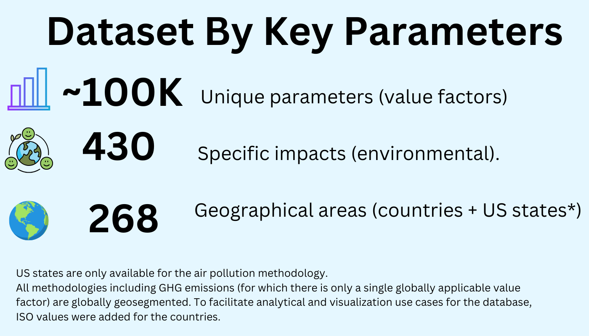

---
language:
- en
pretty_name: IFVI Value Factors - Derivative Dataset For Analysis
---


[](https://github.com/danielrosehill/Global-Value-Factors-Explorer-Dataset)  
[](https://huggingface.co/datasets/danielrosehill/ifvi_valuefactors_deriv)  
[](https://ifvi.org/methodology/environmental-topic-methodology/interim-methodologies/#GlobalValueFactorDatabase)


## 🚀 What if companies' environmental impacts could be quantified in monetary terms!?

<a id="about-the-global-value-factors-explorer-dataset"></a>
## 🌍 About The Global Value Factors Explorer Dataset

The Global Value Factors Database, released by the [International Foundation for Valuing Impacts](https://www.ifvi.org) during UN Climate Week NYC 2023, provides a set of almost 100,000 “value factors” for converting environmental impacts into monetary terms.  

The GVFD covers 430 different environmental impacts across four main categories of impact: air pollution, land use and conversion, waste and water pollution . With the exception of the value factor for greenhouse gas emissions, for which a single value factor is provided ($236/tco2e), the value factors are geographically stratified (in other words, the value factors are both impact-specific and geolocation-specific).  In total, there are 268 geolocations in the dataset reflecting all the world's recognised sovereigns as well as some international dependencies. In addition, one set of value factors, air pollution, provides data at the level of US states. 





# Key Data Parameters

| Parameter             | Value                                                                                               |
|----------------------|---------------------------------------------------------------------------------------------------------------------|
| Value Factors        | Almost 100,000 "value factors" for converting quantitative environmental data into monetary equivalents (USD)          |
| Geolocations         | 268 geolocations (world sovereigns plus US states - for air pollution methodology only)                               |
| Impacts Covered      | Air pollution; GHG emissions; land use and conversion; water use and pollution; waste.                            |
| Parameter Source Data| Global Value Factors Database as released by the International Foundation for Valuing Impacts in September 2024      |
| License              | Licensing in accordance with IFVI, [license link](https://ifvi.org/methodology/environmental-topic-methodology/interim-methodologies/download-form-global-value-factor-database/) |

---

# Impact Categories In Dataset

**Air Pollution**
Pollution is calculated based on metric tons of PM2.5, PM10, SOx, NOx, NH3, and VOCs per year.

**GHG Emissions**
Emissions are valued using a single globally applicable factor of $236 per ton of CO2 equivalent ($/tCO2e).

**Land Conversion**
Land use changes are valued based on categories such as wheat, oilseeds, forestry, and paved land, measured in hectares.

**Land Use**
Land use is valued based on categories including types of agriculture such as wheat and oilseeds and other categories such as forestry and paved land, measured in hectares (ha).

**Waste**
Waste production is valued by categorizing it as hazardous or non-hazardous, and by disposal method (landfill, incineration, unspecified), with the amount measured in kilograms (kg).

**Water Consumption**
Impacts of water consumption are valued based on factors such as malnutrition, water-borne diseases, resource costs, and effects on ecosystems, measured in cubic meters (m³).

**Water Pollution**
Water pollution is valued based on 104 different pollutants, including phosphorus, nitrogen, heavy metals, pesticides, and pharmaceuticals, with the amount of each pollutant measured in kilograms (kg).

---

# Download Links - Value Factors By Methodology (CSV)

| Title               | Format | Link                                                                                                   |
|---------------------|--------|-------------------------------------------------------------------------------------------------------|
| Air Pollution       | CSV    | [](https://huggingface.co/datasets/danielrosehill/ifvi_valuefactors_deriv/resolve/main/data/csv/by-methodology/airpollution.csv) |
| GHG Emissions       | CSV    | [](https://huggingface.co/datasets/danielrosehill/ifvi_valuefactors_deriv/resolve/main/data/csv/by-methodology/ghgs.csv) |
| Land Conversion     | CSV    | [](https://huggingface.co/datasets/danielrosehill/ifvi_valuefactors_deriv/resolve/main/data/csv/by-methodology/land-conversion.csv) |
| Land Use            | CSV    | [](https://huggingface.co/datasets/danielrosehill/ifvi_valuefactors_deriv/resolve/main/data/csv/by-methodology/land-use.csv) |
| Waste               | CSV    | [](https://huggingface.co/datasets/danielrosehill/ifvi_valuefactors_deriv/resolve/main/data/csv/by-methodology/waste.csv) |
| Water Consumption   | CSV    | [](https://huggingface.co/datasets/danielrosehill/ifvi_valuefactors_deriv/resolve/main/data/csv/by-methodology/water-consumption.csv) |
| Water Pollution     | CSV    | [](https://huggingface.co/datasets/danielrosehill/ifvi_valuefactors_deriv/resolve/main/data/csv/by-methodology/water-pollution.csv) |


<a id="links-to-composite-files"></a>
## 🔗 Links to Composite Files

The following links are to concatenated composite versions of the dataset. These are essentially aggregated versions of the data, encompassing all the various parameters across the different methodologies

| Format  | Link |
|---------|------|
| CSV     | [](https://huggingface.co/datasets/danielrosehill/ifvi_valuefactors_deriv/blob/main/data/composite-data/all-formats/composite_value_factors.csv)  |
| JSON    | [](https://huggingface.co/datasets/danielrosehill/ifvi_valuefactors_deriv/blob/main/data/composite-data/all-formats/composite_value_factors.json)  |
| Parquet | [](https://huggingface.co/datasets/danielrosehill/ifvi_valuefactors_deriv/blob/main/data/composite-data/all-formats/composite_value_factors.parquet)  |

The value factors are intended for use by account preparers preparing financial statements which integrate their environmental and social impacts alongside their traditional financial impacts, unifying all their holistic impacts into one set of financial calculations  While the GVFD covers only environmental factors, a key part of the IFVI's mission is also developing methodologies for quantifying social impacts. 

 In order to fulfill their intended purpose, the value factors need to be matched with the raw quantitative environmental data which each value factor is intended to convert into monetary terms (the value factors are expressed as conversions to the US dollar).

This derivative dataset was prepared by me, Daniel Rosehill, in order to facilitate the exploration and analysis of this dataset by non-commercial users.  I believe that there is a strong policy interest in the question of how companies' impacts can be properly accounted for, recognising their societal and planetary effects. 

To facilitate such analysis, I undertook a data reformatting process converting the initial version of the IFVI data from its original format (`XLSM`) and providing it as extracted comma-separated value files, as well as `JSON` structured in various hierarchies, some reflecting a territorial hierarchy (i.e. by geolocation) and others reflecting an impact-first hierarchy (in other words, with the impacts as the primary level, and the geo-stratified value factors nested under them). 

The CSV files should provide the flexibility for users to work with the data as they see fit, while the `JSON` files direct towards specific vantage points and use cases for the data. 

Use of the value factors is governed in accordance with the licensing terms provided by the IFVI (which, at the time of writing, provide for free usage for individual account preparers and non-commercial users.) Those looking to read the full official licence should refer to the website of the IFVI at www.ifvi.org 

 ## 📜 Licensing

This derivative dataset is subject to the same terms of use as the original database, available in `license.md` at the repository root.

## 📅 Versioning

This repository reflects GVFD Version 1 (October 15th, 2024).  It is not guaranteed to be the most recent version.  Consult the IFVI website for the latest data and updates.  While this repository aims to mirror the original GVFD, using this data for official purposes requires referencing the complete IFVI documentation, which is not included here.

<a id="data-formatting"></a>
## 🗂️ Data Formatting

The source data has been restructured for various analytical perspectives:

* **By Methodology:** JSON arrays organized by methodology parameters.
* **By Methodology, By Country:** Mirrors the source database structure (except Land Use and Conversion, which are split into two files).
* **By Territory:**  Organizes data geographically by continent, territory, and US state (US states appear in one methodology). JSON files aggregate data from various methodology tabs.

Additional resources:

* CSV format data.
* `metadata/` folder containing non-data items (e.g., notes from the original database tabs).

<a id="data-modifications"></a>
## 🛠️ Data Modifications

No material data changes were made.  Modifications are limited to formatting and restructuring for analysis.  Two non-material changes (documented in the changelog) are:

* Removal of US dollar signs for easier database integration.
* Standardization of 12 country names to more common versions (e.g., "Bahamas, The" to "Bahamas") and mapping all territories to their ISO-3166 Alpha-2 codes for clarity.

<a id="release-notes-for-v2"></a>

---

# 📝 Release Notes For V2

This release standardises versioning for an early iteration (V2) of the derivative database of the [IFVI Global Value Factors Database (GVFD)](https://ifvi.org/methodology/environmental-topic-methodology/interim-methodologies/).

This package consists of `JSON` representations of the original `XLSM` database contained in the original IFVI data release.

### JSON hierarchies reflecting different organisations of the source data

The data tables in this derivative dataset are organised into various hierarchies to support different data analytics and visualisation use-cases:

- `by-methodology` This folder is divided into subfolders tracking the various methodologies used by the IFVI. The files it contains are "custom" (original) hierarchies representing the data. Not all the methodologies have data tables in this folder.
- `by-methodology-by-country` This folder maps most closely onto the original format in which the data was released and divides the database firstly by methodology and then by country (and then with impacts, values, etc)
- `by-territory` This folder consists of individual JSON files for the various countries and territories (including US states) that were included in some or all of the methodology data releases. The datasets here are organised firstly into geographical continents and then by country (or territory; some of the territories are not widely recognised as independent sovereigns). US states - which were included in one methodology - have their own subfolder.

## Data Modifications (Non-Substantive)

This dataset (and the repository containing it) is a non-official derivative of the International Foundation for Valuing Impact (IFVI) Global Value Factors Database (GVFD) V1.  This derivative dataset is intended to support the programmatic use of the Database for research-related analysis and visualisation. 

This dataset intends to reflect an accurate reformatting of the source data at the time of its compilation. This version of the derivative dataset is based upon the first version of the GVFD as published by the IFVI on October 15th 2024.

No material edits have been made to the source data. 

The following edits were made solely to support the intended use-case:

## Removal of currency symbols

To streamline intake of these `JSON` files into database systems, non-integer data (currency symbols) were scrubbed from the dataset. As is noted in the metadata, the IFVI Database is standardised on the US Dollar. 

## Editing of country and territory names

To assist with geovisualisation use-cases, all countries and territories were matched with their corresponding `alpha-2` values as defined by `ISO 3166`,

In order to render the names of countries and territories in more easily recognisable formatting, the names of 18 countries and territories were lightly reformatted. 

For example `"Bahamas, The"` was renamed `"Bahamas"` and `"Egypt, Arab Rep."` was renamed as simply `"Egypt."` 


## Separation Of Non-Data Entities 

- `metadata` This folder provides individual JSONs which capture the notes that were appended on each tab of the source `XLSM`
- `reference` A static snapshot of the supporting documentation (methodologies and user manuals) released by the IFVI alongside the data release

---

# Data Parameters By Impact Category

#### Air Pollution: Data Description

| **Title**               | **Details**                                                                                                                                                                                                                                           |
|-------------------------|-------------------------------------------------------------------------------------------------------------------------------------------------------------------------------------------------------------------------------------------------------|
| **Dataset Name**        | Air Pollution Methodology                                                                                                                                                                                                                             |
| **Methodology Status**  | Interim                                                                                                                                                                                                                                              |
| **Location-sensitive?** | Yes                                                                                                                                                                                                                                                  |
| **Territories provided**| 197 countries, 51 US states/territories (including Washington, D.C.)                                                                                                                                            |
| **Example parameters**  | PM2.5, PM10, SOx, NOx, NH3, VOC                                                                                                                                                                                                                      |
| **Units**               | Metric tons per year (per pollutant)                                                                                                                                                                                                                  |
| **Sample datapoint**    | Air Pollution_PM2.5_Urban_Primary Health                                                                                                                                                                                                             |

#### GHG Emissions: Data Description

| **Title**               | **Details**                                                                                                                                                                                                                                           |
|-------------------------|-------------------------------------------------------------------------------------------------------------------------------------------------------------------------------------------------------------------------------------------------------|
| **Dataset Name**        | GHG Methodology                                                                                                                                                                                                                                       |
| **Methodology Status**  | Interim                                                                                                                                                                                                                                              |
| **Location-sensitive?** | No                                                                                                                                                                                                                                                   |
| **Territories provided**| N/A                                                                                                                                                                                                                                                  |
| **Example parameters**  | Global warming potential, carbon dioxide equivalency                                                                                                                                                                                                  |
| **Units**               | $/tCO2e (USD per metric ton of CO2 equivalent)                                                                                                                                                                                                       |
| **Sample datapoint**    | 236.0 $/tCO2e                                                                                                                                                                                                                                        |

#### Land Conversion: Data Description

| **Title**               | **Details**                                                                                                                                                                                                                                           |
|-------------------------|-------------------------------------------------------------------------------------------------------------------------------------------------------------------------------------------------------------------------------------------------------|
| **Dataset Name**        | Land Conversion Methodology                                                                                                                                                                                                                           |
| **Methodology Status**  | Interim                                                                                                                                                                                                                                              |
| **Location-sensitive?** | Yes                                                                                                                                                                                                                                                  |
| **Territories provided**| 197 countries                                                                                                                                                                                                                                        |
| **Example parameters**  | Wheat - conventional, Oilseeds - conventional, Cashmere - sustainable, Forestry, Paved                                                                                                                                                                |
| **Units**               | Hectares (for land use categories)                                                                                                                                                                                                                    |
| **Sample datapoint**    | Land Conversion_Wheat - conventional_Lost Ecosystem Services                                                                                                                                                                                          |

#### Land Use: Data Description:

| **Title**               | **Details**                                                                                                                                                                                                                                           |
|-------------------------|-------------------------------------------------------------------------------------------------------------------------------------------------------------------------------------------------------------------------------------------------------|
| **Dataset Name**        | Land Use Methodology                                                                                                                                                                                                                                  |
| **Methodology Status**  | Interim                                                                                                                                                                                                                                              |
| **Location-sensitive?** | Yes                                                                                                                                                                                                                                                  |
| **Territories provided**| 197 countries                                                                                                                                                                                                                                        |
| **Example parameters**  | Wheat - conventional, Oilseeds - conventional, Cashmere - sustainable, Forestry, Paved                                                                                                                                                                |
| **Units**               | Hectares (ha)                                                                                                                                                                                                                                         |
| **Sample datapoint**    | Land Use_Wheat - conventional_Lost Ecosystem Services                                                                                                                                                                                                |

#### Waste: Data Description

| **Title**               | **Details**                                                                                                                                                                                                                                           |
|-------------------------|-------------------------------------------------------------------------------------------------------------------------------------------------------------------------------------------------------------------------------------------------------|
| **Dataset Name**        | Waste Methodology                                                                                                                                                                                                                                     |
| **Methodology Status**  | Interim                                                                                                                                                                                                                                              |
| **Location-sensitive?** | Yes                                                                                                                                                                                                                                                  |
| **Territories provided**| 197 countries                                                                                                                                                                                                                                        |
| **Example parameters**  | Hazardous, Non-Hazardous; disposal methods: Landfill, Incineration, Unspecified                                                                                                                                                                       |
| **Units**               | Kilograms (kg)                                                                                                                                                                                                                                        |
| **Sample datapoint**    | Waste_Hazardous_Landfill_Leachate                                                                                                                                                                                                                    |

#### Water Consumption: Data Description:

| **Title**               | **Details**                                                                                                                                                                                                                                           |
|-------------------------|-------------------------------------------------------------------------------------------------------------------------------------------------------------------------------------------------------------------------------------------------------|
| **Dataset Name**        | Water Consumption Methodology                                                                                                                                                                                                                         |
| **Methodology Status**  | Interim                                                                                                                                                                                                                                              |
| **Location-sensitive?** | No                                                                                                                                                                                                                                                   |
| **Territories provided**| 197 countries                                                                                                                                                                                                                                        |
| **Example parameters**  | Malnutrition, Water-borne disease, Resource cost, Ecosystem services                                                                                                                                                                                  |
| **Units**               | Cubic meters (m³)                                                                                                                                                                                                                                     |
| **Sample datapoint**    | Water Consumption_N/A for WC_N/A for WC_Malnutrition                                                                                                                                                                                                 |

#### Water Pollution: Data Description:

| **Title**               | **Details**                                                                                                                                                                                                                                           |
|-------------------------|-------------------------------------------------------------------------------------------------------------------------------------------------------------------------------------------------------------------------------------------------------|
| **Dataset Name**        | Water Pollution Methodology                                                                                                                                                                                                                           |
| **Methodology Status**  | Interim                                                                                                                                                                                                                                              |
| **Location-sensitive?** | Yes                                                                                                                                                                                                                                                  |
| **Territories provided**| 197 countries                                                                                                                                                                                                                                        |
| **Example parameters**  | Phosphorus, Nitrogen, Heavy Metals (e.g., Cadmium, Lead, Mercury), Pesticides, Pharmaceuticals (e.g., Antibiotics, NSAIDs)                                                                                                                            |
| **Units**               | Kilograms (kg)                                                                                                                                                                                                                                        |
| **Sample datapoint**    | Water Pollution_Phosphorus_N/A for this Category_Eutrophication                                                                                                                                                                                       |

# Sample Data Values By Methodology

<a id="sample-data"></a>
## 🧪 Sample Data

### Air Pollution

```csv
Country,Category,Location,Impact,Units,Reference,Value
Afghanistan,PM2.5,Urban,Primary Health,/metric ton,Air Pollution_PM2.5_Urban_Primary Health,"40,495.28"
Afghanistan,PM2.5,Peri-Urban,Primary Health,/metric ton,Air Pollution_PM2.5_Peri-Urban_Primary Health,"34,468.58"
Afghanistan,PM2.5,Rural,Primary Health,/metric ton,Air Pollution_PM2.5_Rural_Primary Health,"19,386.52"
Afghanistan,PM2.5,Transport,Primary Health,/metric ton,Air Pollution_PM2.5_Transport_Primary Health,"31,346.36"
Afghanistan,PM2.5,N/A for PM2.5,Visibility,/metric ton,Air Pollution_PM2.5_N/A for PM2.5_Visibility,4.78
Afghanistan,SOx,Urban,Primary Health,/metric ton,Air Pollution_SOx_Urban_Primary Health,"13,398.15"
Afghanistan,SOx,Peri-Urban,Primary Health,/metric ton,Air Pollution_SOx_Peri-Urban_Primary Health,"13,345.45"
Afghanistan,SOx,Rural,Primary Health,/metric ton,Air Pollution_SOx_Rural_Primary Health,"6,694.38"
Afghanistan,SOx,Transport,Primary Health,/metric ton,Air Pollution_SOx_Transport_Primary Health,"10,893.71"
Afghanistan,SOx,N/A for SOx,Visibility,/metric ton,Air Pollution_SOx_N/A for SOx_Visibility,31.86
Afghanistan,NH3,Urban,Primary Health,/metric ton,Air Pollution_NH3_Urban_Primary Health,"12,148.59"
Afghanistan,NH3,Peri-Urban,Primary Health,/metric ton,Air Pollution_NH3_Peri-Urban_Primary Health,"10,340.57"
Afghanistan,NH3,Rural,Primary Health,/metric ton,Air Pollution_NH3_Rural_Primary Health,"5,815.95"
Afghanistan,NH3,Transport,Primary Health,/metric ton,Air Pollution_NH3_Transport_Primary Health,"9,403.91"
Afghanistan,NH3,N/A for NH3,Visibility,/metric ton,Air Pollution_NH3_N/A for NH3_Visibility,6.06
Afghanistan,PM10,Urban,Primary Health,/metric ton,Air Pollution_PM10_Urban_Primary Health,260.51
Afghanistan,PM10,Peri-Urban,Primary Health,/metric ton,Air Pollution_PM10_Peri-Urban_Primary Health,238.92
Afghanistan,PM10,Rural,Primary Health,/metric ton,Air Pollution_PM10_Rural_Primary Health,120.84
```

### Land Conversion

```
Country,Category,Location,Impact,Units,Reference,Value
Afghanistan,Wheat - conventional,N/A for LULC,Lost Ecosystem Services,/ha,Land Conversion_Wheat - conventional_N/A for LULC_Lost Ecosystem Services,"12,573.76"
Afghanistan,"Vegetables, fruit, nuts - conventional",N/A for LULC,Lost Ecosystem Services,/ha,"Land Conversion_Vegetables, fruit, nuts - conventional_N/A for LULC_Lost Ecosystem Services","14,424.09"
Afghanistan,"Cereals, grains - conventional",N/A for LULC,Lost Ecosystem Services,/ha,"Land Conversion_Cereals, grains - conventional_N/A for LULC_Lost Ecosystem Services","12,573.76"
Afghanistan,Oilseeds - conventional,N/A for LULC,Lost Ecosystem Services,/ha,Land Conversion_Oilseeds - conventional_N/A for LULC_Lost Ecosystem Services,"12,573.76"
Afghanistan,"Sugarcane, sugarbeet - conventional",N/A for LULC,Lost Ecosystem Services,/ha,"Land Conversion_Sugarcane, sugarbeet - conventional_N/A for LULC_Lost Ecosystem Services","12,573.76"
Afghanistan,Plant-based fibers - conventional,N/A for LULC,Lost Ecosystem Services,/ha,Land Conversion_Plant-based fibers - conventional_N/A for LULC_Lost Ecosystem Services,"12,573.76"
Afghanistan,Other crops - conventional,N/A for LULC,Lost Ecosystem Services,/ha,Land Conversion_Other crops - conventional_N/A for LULC_Lost Ecosystem Services,"12,573.76"
Afghanistan,Other crops - organic,N/A for LULC,Lost Ecosystem Services,/ha,Land Conversion_Other crops - organic_N/A for LULC_Lost Ecosystem Services,"11,640.73"
Afghanistan,Other crops - sustainable,N/A for LULC,Lost Ecosystem Services,/ha,Land Conversion_Other crops - sustainable_N/A for LULC_Lost Ecosystem Services,"10,870.67"
Afghanistan,"Bovine, sheep, goats, horses - conventional",N/A for LULC,Lost Ecosystem Services,/ha,"Land Conversion_Bovine, sheep, goats, horses - conventional_N/A for LULC_Lost Ecosystem Services","14,200.25"
Afghanistan,"Bovine, sheep, goats, horses - organic",N/A for LULC,Lost Ecosystem Services,/ha,"Land Conversion_Bovine, sheep, goats, horses - organic_N/A for LULC_Lost Ecosystem Services","13,676.30"
Afghanistan,"Bovine, sheep, goats, horses - sustainable",N/A for LULC,Lost Ecosystem Services,/ha,"Land Conversion_Bovine, sheep, goats, horses - sustainable_N/A for LULC_Lost Ecosystem Services","13,521.12"
Afghanistan,Cashmere - conventional,N/A for LULC,Lost Ecosystem Services,/ha,Land Conversion_Cashmere - conventional_N/A for LULC_Lost Ecosystem Services,"14,724.20"
Afghanistan,Cashmere - organic,N/A for LULC,Lost Ecosystem Services,/ha,Land Conversion_Cashmere - organic_N/A for LULC_Lost Ecosystem Services,"13,676.30"
Afghanistan,Cashmere - sustainable,N/A for LULC,Lost Ecosystem Services,/ha,Land Conversion_Cashmere - sustainable_N/A for LULC_Lost Ecosystem Services,"13,521.12"
Afghanistan,Forestry,N/A for LULC,Lost Ecosystem Services,/ha,Land Conversion_Forestry_N/A for LULC_Lost Ecosystem Services,"1,441.78"
Afghanistan,Paddy rice,N/A for LULC,Lost Ecosystem Services,/ha,Land Conversion_Paddy rice_N/A for LULC_Lost Ecosystem Services,"10,984.10"
```

### Land Use

```
Country,Category,Location,Impact,Units,Reference,Value
Afghanistan,Wheat - conventional,N/A for LULC,Lost Ecosystem Services,/ha,Land Use_Wheat - conventional_N/A for LULC_Lost Ecosystem Services,216.64
Afghanistan,"Vegetables, fruit, nuts - conventional",N/A for LULC,Lost Ecosystem Services,/ha,"Land Use_Vegetables, fruit, nuts - conventional_N/A for LULC_Lost Ecosystem Services",248.52
Afghanistan,"Cereals, grains - conventional",N/A for LULC,Lost Ecosystem Services,/ha,"Land Use_Cereals, grains - conventional_N/A for LULC_Lost Ecosystem Services",216.64
Afghanistan,Oilseeds - conventional,N/A for LULC,Lost Ecosystem Services,/ha,Land Use_Oilseeds - conventional_N/A for LULC_Lost Ecosystem Services,216.64
Afghanistan,"Sugarcane, sugarbeet - conventional",N/A for LULC,Lost Ecosystem Services,/ha,"Land Use_Sugarcane, sugarbeet - conventional_N/A for LULC_Lost Ecosystem Services",216.64
Afghanistan,Plant-based fibers - conventional,N/A for LULC,Lost Ecosystem Services,/ha,Land Use_Plant-based fibers - conventional_N/A for LULC_Lost Ecosystem Services,216.64
Afghanistan,Other crops - conventional,N/A for LULC,Lost Ecosystem Services,/ha,Land Use_Other crops - conventional_N/A for LULC_Lost Ecosystem Services,216.64
Afghanistan,Other crops - organic,N/A for LULC,Lost Ecosystem Services,/ha,Land Use_Other crops - organic_N/A for LULC_Lost Ecosystem Services,200.56
Afghanistan,Other crops - sustainable,N/A for LULC,Lost Ecosystem Services,/ha,Land Use_Other crops - sustainable_N/A for LULC_Lost Ecosystem Services,187.3
Afghanistan,"Bovine, sheep, goats, horses - conventional",N/A for LULC,Lost Ecosystem Services,/ha,"Land Use_Bovine, sheep, goats, horses - conventional_N/A for LULC_Lost Ecosystem Services",244.66
Afghanistan,"Bovine, sheep, goats, horses - organic",N/A for LULC,Lost Ecosystem Services,/ha,"Land Use_Bovine, sheep, goats, horses - organic_N/A for LULC_Lost Ecosystem Services",235.64
Afghanistan,"Bovine, sheep, goats, horses - sustainable",N/A for LULC,Lost Ecosystem Services,/ha,"Land Use_Bovine, sheep, goats, horses - sustainable_N/A for LULC_Lost Ecosystem Services",232.96
Afghanistan,Cashmere - conventional,N/A for LULC,Lost Ecosystem Services,/ha,Land Use_Cashmere - conventional_N/A for LULC_Lost Ecosystem Services,253.69
Afghanistan,Cashmere - organic,N/A for LULC,Lost Ecosystem Services,/ha,Land Use_Cashmere - organic_N/A for LULC_Lost Ecosystem Services,235.64
Afghanistan,Cashmere - sustainable,N/A for LULC,Lost Ecosystem Services,/ha,Land Use_Cashmere - sustainable_N/A for LULC_Lost Ecosystem Services,232.96
Afghanistan,Forestry,N/A for LULC,Lost Ecosystem Services,/ha,Land Use_Forestry_N/A for LULC_Lost Ecosystem Services,24.84
Afghanistan,Paddy rice,N/A for LULC,Lost Ecosystem Services,/ha,Land Use_Paddy rice_N/A for LULC_Lost Ecosystem Services,189.25
Afghanistan,Paved,N/A for LULC,Lost Ecosystem Services,/ha,Land Use_Paved_N/A for LULC_Lost Ecosystem Services,312.21
```

### Waste

```
Country,Category,Location,Impact,Units,Reference,Value
Afghanistan,Hazardous,Landfill,Leachate,/kg,Waste_Hazardous_Landfill_Leachate,18.19
Afghanistan,Hazardous,Landfill,Waste GHGs,/kg,Waste_Hazardous_Landfill_Waste GHGs,179.15
Afghanistan,Hazardous,Landfill,Disamenity,/kg,Waste_Hazardous_Landfill_Disamenity,45.96
Afghanistan,Non-Hazardous,Landfill,Leachate,/kg,Waste_Non-Hazardous_Landfill_Leachate,0.3
Afghanistan,Non-Hazardous,Landfill,Waste GHGs,/kg,Waste_Non-Hazardous_Landfill_Waste GHGs,179.15
Afghanistan,Non-Hazardous,Landfill,Disamenity,/kg,Waste_Non-Hazardous_Landfill_Disamenity,45.96
Afghanistan,Hazardous,Incineration,Waste GHGs,/kg,Waste_Hazardous_Incineration_Waste GHGs,386.36
Afghanistan,Hazardous,Incineration,Disamenity,/kg,Waste_Hazardous_Incineration_Disamenity,3.01
Afghanistan,Hazardous,Incineration,Waste Air pollution,/kg,Waste_Hazardous_Incineration_Waste Air pollution,18.28
Afghanistan,Hazardous,Incineration,Heavy metals and dioxins,/kg,Waste_Hazardous_Incineration_Heavy metals and dioxins,4.93
Afghanistan,Non-Hazardous,Incineration,Waste GHGs,/kg,Waste_Non-Hazardous_Incineration_Waste GHGs,124.02
Afghanistan,Non-Hazardous,Incineration,Disamenity,/kg,Waste_Non-Hazardous_Incineration_Disamenity,3.01
Afghanistan,Non-Hazardous,Incineration,Waste Air pollution,/kg,Waste_Non-Hazardous_Incineration_Waste Air pollution,18.28
Afghanistan,Non-Hazardous,Incineration,Heavy metals and dioxins,/kg,Waste_Non-Hazardous_Incineration_Heavy metals and dioxins,4.93
Afghanistan,Hazardous,Unspecified,Leachate,/kg,Waste_Hazardous_Unspecified_Leachate,0.0
Afghanistan,Hazardous,Unspecified,Waste Air pollution,/kg,Waste_Hazardous_Unspecified_Waste Air pollution,18.28
Afghanistan,Hazardous,Unspecified,Heavy metals and dioxins,/kg,Waste_Hazardous_Unspecified_Heavy metals and dioxins,4.93
Afghanistan,Hazardous,Unspecified,Disamenity,/kg,Waste_Hazardous_Unspecified_Disamenity,3.01
Afghanistan,Hazardous,Unspecified,Waste GHGs,/kg,Waste_Hazardous_Unspecified_Waste GHGs,386.36
Afghanistan,Non-Hazardous,Unspecified,Leachate,/kg,Waste_Non-Hazardous_Unspecified_Leachate,0.3
Afghanistan,Non-Hazardous,Unspecified,Waste Air pollution,/kg,Waste_Non-Hazardous_Unspecified_Waste Air pollution,0.0
Afghanistan,Non-Hazardous,Unspecified,Heavy metals and dioxins,/kg,Waste_Non-Hazardous_Unspecified_Heavy metals and dioxins,0.0
Afghanistan,Non-Hazardous,Unspecified,Disamenity,/kg,Waste_Non-Hazardous_Unspecified_Disamenity,45.96
Afghanistan,Non-Hazardous,Unspecified,Waste GHGs,/kg,Waste_Non-Hazardous_Unspecified_Waste GHGs,179.15
```

### Water Consumption

```
Country,Category,Location,Impact,Units,Reference,Value
Afghanistan,N/A for WC,N/A for WC,Malnutrition,/m3,Water Consumption_N/A for WC_N/A for WC_Malnutrition,0.49
Afghanistan,N/A for WC,N/A for WC,Water-borne disease,/m3,Water Consumption_N/A for WC_N/A for WC_Water-borne disease,0.06
Afghanistan,N/A for WC,N/A for WC,Resource cost,/m3,Water Consumption_N/A for WC_N/A for WC_Resource cost,0.32
Afghanistan,N/A for WC,N/A for WC,Ecosystem services,/m3,Water Consumption_N/A for WC_N/A for WC_Ecosystem services,0.28
Albania,N/A for WC,N/A for WC,Malnutrition,/m3,Water Consumption_N/A for WC_N/A for WC_Malnutrition,0.02
Albania,N/A for WC,N/A for WC,Water-borne disease,/m3,Water Consumption_N/A for WC_N/A for WC_Water-borne disease,0.13
Albania,N/A for WC,N/A for WC,Resource cost,/m3,Water Consumption_N/A for WC_N/A for WC_Resource cost,1.0
Albania,N/A for WC,N/A for WC,Ecosystem services,/m3,Water Consumption_N/A for WC_N/A for WC_Ecosystem services,1.94
Algeria,N/A for WC,N/A for WC,Malnutrition,/m3,Water Consumption_N/A for WC_N/A for WC_Malnutrition,0.24
Algeria,N/A for WC,N/A for WC,Water-borne disease,/m3,Water Consumption_N/A for WC_N/A for WC_Water-borne disease,0.0
Algeria,N/A for WC,N/A for WC,Resource cost,/m3,Water Consumption_N/A for WC_N/A for WC_Resource cost,0.43
Algeria,N/A for WC,N/A for WC,Ecosystem services,/m3,Water Consumption_N/A for WC_N/A for WC_Ecosystem services,0.08
American Samoa,N/A for WC,N/A for WC,Malnutrition,/m3,Water Consumption_N/A for WC_N/A for WC_Malnutrition,0.3
American Samoa,N/A for WC,N/A for WC,Water-borne disease,/m3,Water Consumption_N/A for WC_N/A for WC_Water-borne disease,0.11
American Samoa,N/A for WC,N/A for WC,
```

# Water Pollution

```
Country,Category,Location,Impact,Units,Reference,Value
Afghanistan,Phosphorus,N/A for this Category,Eutrophication,/kg,Water Pollution_Phosphorus_N/A for this Category_Eutrophication,96.6218
Afghanistan,Nitrogen,N/A for this Category,Eutrophication,/kg,Water Pollution_Nitrogen_N/A for this Category_Eutrophication,0.0000
Afghanistan,Ag(I),Freshwater,Health,/kg,Water Pollution_Ag(I)_Freshwater_Health,41.6088
Afghanistan,Ag(I),Seawater,Health,/kg,Water Pollution_Ag(I)_Seawater_Health,0.8362
Afghanistan,Ag(I),Unspecified,Health,/kg,Water Pollution_Ag(I)_Unspecified_Health,41.6088
Afghanistan,As(III),Freshwater,Health,/kg,Water Pollution_As(III)_Freshwater_Health,"2,018.0068"
Afghanistan,As(III),Seawater,Health,/kg,Water Pollution_As(III)_Seawater_Health,169.1855
Afghanistan,As(III),Unspecified,Health,/kg,Water Pollution_As(III)_Unspecified_Health,"2,018.0068"
Afghanistan,As(V),Freshwater,Health,/kg,Water Pollution_As(V)_Freshwater_Health,"2,018.0068"
Afghanistan,As(V),Seawater,Health,/kg,Water Pollution_As(V)_Seawater_Health,169.1855
Afghanistan,As(V),Unspecified,Health,/kg,Water Pollution_As(V)_Unspecified_Health,"2,018.0068"
Afghanistan,Ba(II),Freshwater,Health,/kg,Water Pollution_Ba(II)_Freshwater_Health,64.0374
Afghanistan,Ba(II),Seawater,Health,/kg,Water Pollution_Ba(II)_Seawater_Health,12.9373
```

---

## Author (Source Database / GVFD)

- The International Foundation for Valuing Impacts (IFVI)

[](https://www.ifvi.org)

## Author (Repository / Derivative Dataset)

- Daniel Rosehill  

[](https://danielrosehill.com)